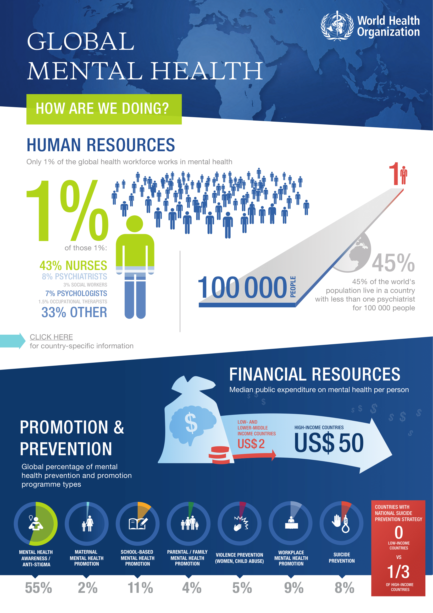
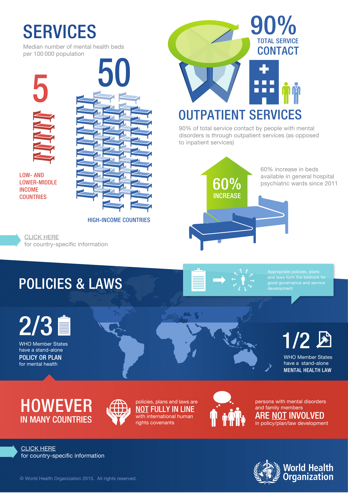

### Team Wellness Identifying Mental Health Stressors In The Workplace

#### Project Get Better By Any Means Necessary

_Ryan Bogatez_  
_Samuel Chris_  
_Jove Calimlim_  
_Eugene Lim_

_INFO-201: Technical Foundations of Informatics_  
_The Information School_  
_University of Washington_  
_Autumn 2019_

#### 1.0 Introduction

###### 1.1 Problem Situation

Mental health has become an increasingly hot issue in the workplace. The mental health of employees is being negatively impacted by numerous factors within the workplace. Due to this, there is an increased strain on worker performance which is also negatively affecting company results. Currently, mental health is a stigmatized topic in the workplace. Mental health is an area of high confidentiality between employees and employers.

###### 1.2 What Is The Problem?

Approximately half of millennial workers and 75% of Gen-Zers have quit their jobs due to mental health reasons according to a survey conducted by Mind Share Partners, SAP, and Qualtrics. About 46.6 million US adults are dealing with mental illnesses, including depression and anxiety disorders. The main factors contributing to this is money, work load, and a negative working environment.

###### 1.3 Why Does It Matter?

Employee turnover has a huge cost for businesses, including rehiring, severance pay, and workplace morale. For the individual employees, this can lead to further anxiety and stress in finding a new job and explaining their situation to others. For our group, this topic is important to us because we will all be graduating at some point and joining the workforce.

###### 1.4 How Will It Be Addressed?

We will first be looking at various data sets that look at employee stress levels in the tech industry and cross check them for any common factors or answers that could potentially contribute to worker stress. We will then look for methods to mitigate the risks of mental health in the workplace and propose some solutions to provide a healthier workplace environment.

#### 2.0 Research Questions

* What is the biggest driver of mental illness in the workplace?

* What’s the most common mental health issue among workers?

#### 3.0 Possible Data Sets

* [Survey on Mental Health in the Tech Workplace in 2014](https://www.kaggle.com/osmi/mental-health-in-tech-survey)
  * This data set that we found on Kaggle has 27 columns with 1260 rows of observations. This data originated from a 2014 survey that measured attitudes about mental health in the technology workplace.

* [Open Sourcing Mental Illness Survey in 2017](https://data.world/dataforacause/osmi-mental-health-clean/workspace/file?filename=Data_for_a_Cause_OSMIhelp%2FData-for-a-Cause-OSMIhelp%2FOSMI-Survey-Data.csv)
  * This data set has 30 columns and 59,535 rows of observations. This data set that we originally found on data.world is gathered from a yearly survey hosted by OSMI, a non-profit organization researching mental illness in the tech and open-source communities. The survey results were collected from March 2017.

#### 4.0 Info Visualizations

_Figure 1. The first part of this infographic by the World Health Organization introduces the problem area of mental health in the workplace by putting into perspective the amount of effort and money that is being spent on mental wellbeing. This graphic is useful to us because it gives us an idea of what companies are prioritizing in terms of their employees._

_Figure 2. The second part of this infographic by the World Health Organization shows what kind of services and policies being put into place in improving the mental health of employees across the world. This graphic is useful to us because it shows us what's currently being done to address the mental wellbeing of employees._

#### 5.0 Team Coordination

We plan to meet each week on Monday and Wednesday morning from 9:00 AM to 10:00 AM. After discussing our goals and what we want to get out of this class, we all want to become proficient in using the R programming language and being able to create meaningful and informative data visualizations to use in our future careers. We have all agreed to using Facebook Messenger for communication. Whenever we encounter work breakdowns or communication challenges, we will make sure to address them in-person before lecture on Monday and Wednesday, and if needed, rely on our amazing TA Benji Xie for any recommendations on working through these challenges.

###### Dates of Unavailability:

* Ryan: Nov. 18

#### 6.0 References

###### Sources:

1. America’s mental health disparities. (2018, December 10). Retrieved November 4, 2019, from Counseling Today website: https://ct.counseling.org/2018/12/americas-mental-health-disparities-2/  

2. Hoffower, H. (n.d.). 50% of millennials have left a job for mental-health reasons, a new study found—And it speaks to some of the biggest problems plaguing the entire generation. Retrieved November 4, 2019, from Business Insider website: https://www.businessinsider.com/half-of-millennials-left-jobs-for-mental-health-reasons-2019-10  

3. WHO | Mental health in the workplace. (n.d.). Retrieved November 4, 2019, from WHO website: http://www.who.int/mental_health/in_the_workplace/en/  

4. WHO | Project Atlas. (n.d.). Retrieved November 4, 2019, from WHO website: http://www.who.int/mental_health/evidence/atlasmnh/en/
